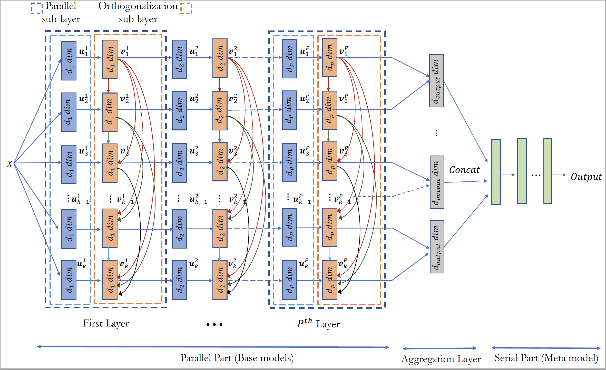
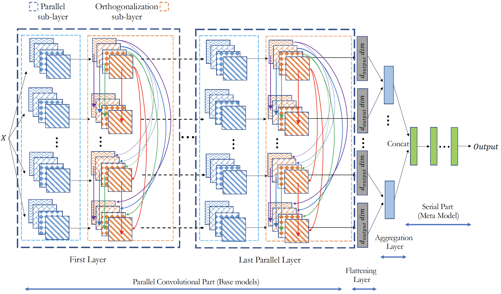

# Parallel Orthogonal Deep Neural Network (PODNN)

<p align='justify'>PODNN is a method lies in the intersection of deep learning and ensmeble methods. It makes efficient use of deep neural networks in an ensmble setting. It consists of a number of parallel deep neural networks that are made parallel together. Each parallel sub-layer is followed by an orthogonalization sub-layer. These parallel part of the architecture is then followed by aggregation layer and meta part. Architecutre of PODNN is shown in the following figure.</p>
For further detailes about PODNN, please refer to the [paper](https://www.sciencedirect.com/science/article/pii/S0893608021000824).

<br>



<br>

<p align='justify'>The main promise of PODNN stems from the enforced diversity mechanism caused by orthogonalization sub-layers. The embeded diversity mechanism make effective use of a number of deep models since each deep model will provide a considerable deal of contributation to the final prections. </p>

<p align='justify'>The implementation of PODNN is available in both <strong>Tensorflow</strong> and <strong>Pytorch</strong>. </p>

<h3> Installation

```
git clone https://gitlab.com/peeymansh/podnn.git
python setup.py install
```


## Usage examples

### Pytorch

```python
import podnn_torch
import torch
from torch import nn
from sklearn.preprocessing import StandardScaler
from sklearn import datasets

x = torch.from_numpy(datasets.load_breast_cancer().data).float()
y = torch.from_numpy(datasets.load_breast_cancer().target.reshape(-1,1)).float()

unit_model_1 = torch.nn.Sequential(
    nn.Linear(in_features=30, out_features=12),
    nn.ReLU(),
    nn.Linear(in_features=12,out_features=6),
    nn.BatchNorm1d(num_features=6)
)

unit_model_2 = torch.nn.Sequential(
    nn.Linear(in_features=6, out_features=4),
)

model = torch.nn.Sequential(
    podnn_torch.InputLayer(n_models=6),
    podnn_torch.ParallelLayer(unit_model_1),
    podnn_torch.OrthogonalLayer2D(),
    podnn_torch.ParallelLayer(unit_model_2),
    podnn_torch.AggregationLayer(stride=2,input_dim=4),
    nn.Linear(in_features=podnn_torch.agg_out_dim,out_features=1),
    torch.nn.Sigmoid()
)
criterion = torch.nn.BCELoss(reduction='mean')
optimizer = torch.optim.Adam(model.parameters(), lr=1e-2)

epochs = 500
for t in range(epochs):
    y_pred = model(x)
    loss = criterion(y_pred, y)
    print(t, loss.item())
    optimizer.zero_grad()
    loss.backward()
    optimizer.step()
```

### Tensorflow

```python
import podnn_tensorflow
import tensorflow as tf
from tensorflow.keras import Model
from sklearn import datasets
tf.random.set_seed(3)

x = tf.convert_to_tensor(datasets.load_breast_cancer().data)
y = tf.convert_to_tensor(datasets.load_breast_cancer().target.reshape(-1,1))

unit_model_1 = [
    tf.keras.layers.Dense(12),
    tf.keras.layers.ReLU(),
    tf.keras.layers.Dense(6),
    tf.keras.layers.BatchNormalization()
]

unit_model_2 = [
    tf.keras.layers.Dense(4)
]

class podnnModel(Model):
    def __init__(self):
        super(podnnModel, self).__init__()
 				pass

    def build(self,input_shape):
        self.InputLayer = podnn_tensorflow.InputLayer(n_models=4)
        self.ParallelLayer1 = podnn_tensorflow.ParallelLayer(unit_model_1)
        self.OrthogonalLayer = podnn_tensorflow.OrthogonalLayer2D()
        self.ParallelLayer2 = podnn_tensorflow.ParallelLayer(unit_model_2)
        self.AggregationLayer = podnn_tensorflow.AggregationLayer(stride=2, input_dim=4)
        self.DenseLayer = tf.keras.layers.Dense(1, activation='sigmoid')

    def call(self,x):
        x = self.InputLayer(x)
        x = self.ParallelLayer1(x)
        x = self.OrthogonalLayer(x)
        x = self.ParallelLayer2(x)
        x = self.AggregationLayer(x)
        x = self.DenseLayer(x)
        return x

loss_object = tf.keras.losses.BinaryCrossentropy()
optimizer = tf.keras.optimizers.Adam(learning_rate=0.01)
train_loss = tf.keras.metrics.Mean()
train_accuracy = tf.keras.metrics.BinaryAccuracy(name='train_accuracy')

model = podnnModel()

@tf.function
def train_step(x, labels):
      with tf.GradientTape() as tape:
            predictions = model(x)
            loss = loss_object(labels, predictions)
      gradients = tape.gradient(loss, model.trainable_variables)
      optimizer.apply_gradients(zip(gradients, model.trainable_variables))
      train_loss(loss)
      train_accuracy(labels, tf.squeeze(predictions))

epochs = 500
for i in range(epochs):
      train_loss.reset_states()
      train_accuracy.reset_states()
      train_step(x, y)
      print('train loss='+str(train_loss.result()))
      print('train accuracy=' + str(train_accuracy.result()))
```

<br>

## Convolutional PODNN

<p align='justify'> Convolutional PODNN extends the idea of orthogonalization to the output of convulutional filters in an ensemble of Convolutional deep neural network.  Architecutre of PODNN is shown in the following figure.  </p>


<br>

## Usage examples

### Pytorch

```python
import podnn_torch
import torch
from torch import nn
from torchvision import datasets,transforms

batch_size=64
train_kwargs = {'batch_size': batch_size}
test_kwargs = {'batch_size': batch_size}
transform=transforms.Compose([
        transforms.ToTensor(),
        transforms.Normalize((0.0001,), (1,))
        ])
dataset1 = datasets.MNIST('../data', train=True, download=True,
                          transform=transform)
dataset2 = datasets.MNIST('../data', train=False,
                          transform=transform)
train_loader = torch.utils.data.DataLoader(dataset1, **train_kwargs)
test_loader = torch.utils.data.DataLoader(dataset2, **test_kwargs)

unit_model_1 = torch.nn.Sequential(
    nn.Conv2d(1, 32, 3, 1),
    nn.ReLU(),
    nn.BatchNorm2d(32),
)

unit_model_2 = torch.nn.Sequential(
    nn.Conv2d(32,16,3,1),
    nn.ReLU(),
    nn.MaxPool2d(2),
    nn.Flatten(1),
    nn.Linear(in_features=2304,out_features=128),
    nn.ReLU()
)

model = torch.nn.Sequential(
    podnn_torch.InputLayer(n_models=4),
    podnn_torch.ParallelLayer(unit_model_1),
    podnn_torch.OrthogonalLayer3D(),
    podnn_torch.ParallelLayer(unit_model_2),
    podnn_torch.AggregationLayer(stride=2,input_dim=128,output_dim=10),
    nn.Linear(in_features=20,out_features=10),
    torch.nn.Softmax()
)

criterion = torch.nn.CrossEntropyLoss()
optimizer = torch.optim.Adam(model.parameters(), lr=1e-3)

epochs = 10
for t in range(epochs):
    for x, y in train_loader:
        y_pred = model(x)
        loss = criterion(y_pred, y)
        print(t, loss.item())
        optimizer.zero_grad()
        loss.backward()
        optimizer.step()
```

### Tensorflow
```python
import podnn_tensorflow
import tensorflow as tf
import numpy as np
from tensorflow.keras import layers,Model
tf.random.set_seed(3)

mnist = tf.keras.datasets.mnist

(x_train, y_train), (x_test, y_test) = mnist.load_data()

x_train = x_train / 255.0
x_test = x_test / 255.0

x_train = tf.convert_to_tensor(np.expand_dims(x_train,axis=3))
x_test = tf.convert_to_tensor(np.expand_dims(x_test,axis=3))

batch_size=64
im_height = 32
im_width = 32
train_ds = tf.data.Dataset.from_tensor_slices(
    (x_train, y_train)).shuffle(1000).batch(batch_size)

unit_model_1 = [
    tf.keras.layers.Conv2D(32, 3, input_shape=[im_height,im_width,1]),
    tf.keras.layers.BatchNormalization()
]
unit_model_2 = [
    tf.keras.layers.Conv2D(16, 3, input_shape=[26,26,32]),
    tf.keras.layers.MaxPooling2D(2),
    tf.keras.layers.Flatten(),
    tf.keras.layers.Dense(128,activation='relu')
]

class podnnModel(Model):
    def __init__(self):
        super(podnnModel, self).__init__()
        pass

    def build(self,input_shape):
        self.InputLayer = podnn_tensorflow.InputLayer(n_models=4)
        self.ParallelLayer = podnn_tensorflow.ParallelLayer(unit_model_1)
        self.OrthogonalLayer = podnn_tensorflow.OrthogonalLayer3D()
        self.ParallelLayer2 = podnn_tensorflow.ParallelLayer(unit_model_2)
        self.AggregationLayer = podnn_tensorflow.AggregationLayer(stride=2, output_dim=10)
        self.DenseLayer = layers.Dense(10, activation='softmax')

    def call(self,x):
        x = self.InputLayer(x)
        x = self.ParallelLayer(x)
        x = self.OrthogonalLayer(x)
        x = self.ParallelLayer2(x)
        x = self.AggregationLayer(x)
        x = self.DenseLayer(x)
        return x

model = podnnModel()

loss_object = tf.keras.losses.SparseCategoricalCrossentropy(from_logits=True)
optimizer = tf.keras.optimizers.Adam()
train_loss = tf.keras.metrics.Mean()

@tf.function
def train_step(x, labels):

      with tf.GradientTape() as tape:
            predictions = model(x)
            loss = loss_object(labels, predictions)
      gradients = tape.gradient(loss, model.trainable_variables)
      optimizer.apply_gradients(zip(gradients, model.trainable_variables))
      train_loss(loss)

epochs = 10
for epoch in range(epochs):
      train_loss.reset_states()

      for images, labels in train_ds:
          train_step(images, labels)
          print('train loss=' + str(train_loss.result()))
```


